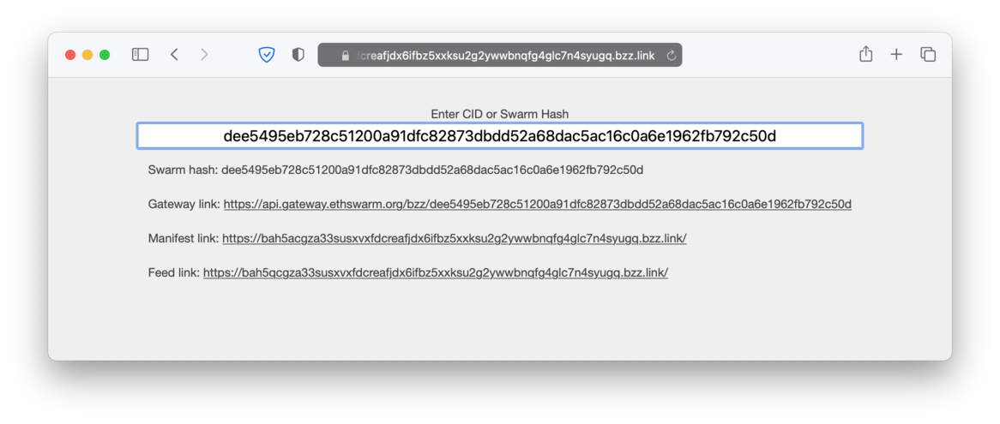

# Swarm ID converter

This project is a small web app where you can paste a Swarm hash or a Swarm CID and it will print the appropriate Gateway or bzz.link addresses.



## Installation

Installing npm packages:

```
npm install
```

Building the bundle:

```
npm run bundle
```

Deployment with [swarm-cli](https://github.com/ethersphere/swarm-cli)
```
swarm-cli upload dist
```

